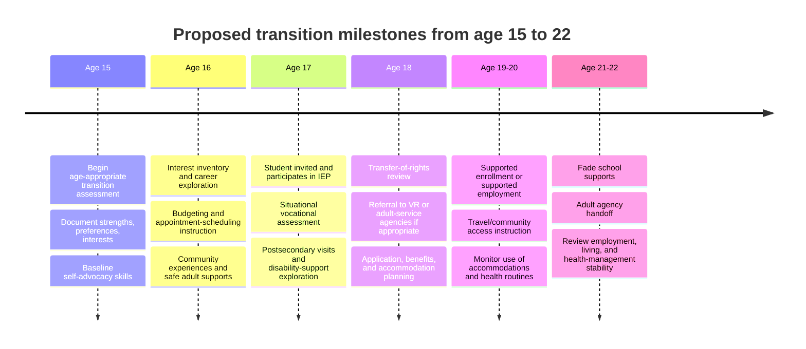

# Indicator 13 Review of Sample High School IEP

## Executive Summary

This review finds that the sample high-school IEP for Jimmy meets **basic Indicator 13 transition-compliance expectations**, but only **partially meets the standard for high-quality, individualized transition planning**. The strongest parts of the IEP are its unusually detailed present levels, health and safety planning, and the fact that it includes the core transition-age elements: postsecondary goals, transition needs, a course of study, measurable annual goals, and coordinated transition activities. The weakest parts are the **limited evidence of age-appropriate transition assessment**, the **absence of visible student invitation documentation**, the **lack of agency coordination**, and the fact that Jimmy’s transition goals are still too **academic-only** for a student with complex medical, communication, social, and self-advocacy needs. In other words, the transition section is **legally recognizable and partly appropriate**, but it is not yet robust enough to match the reality of Jimmy’s postsecondary life. fileciteturn0file1 fileciteturn0file0 citeturn9view0turn10view0

## Retrieved Files and Source Status

The attached course files were sufficient to complete the review. However, the exact **ED452C GitHub file-level commit SHAs** and the separate **Blackboard Indicator 13 Checklist Template** were **not retrievable from the accessible public GitHub session**. The public EDU498 repo was accessible and useful for course-lens framing; the MLADIS repo was not publicly retrievable in this session. Because the Blackboard checklist template itself was not available, the filled checklist below uses an **IDEA/OSEP-aligned Indicator 13 structure** based on the federal transition requirements in **34 C.F.R. §§ 300.320(b) and 300.321(b)** and the common monitoring elements used in Indicator 13 reviews. fileciteturn0file1 fileciteturn0file0 citeturn2view1turn2view0turn28view0turn9view0turn10view0

| File / source | Retrieval status | Commit SHA status |
|---|---|---|
| Sample IEP High School.pdf | Retrieved from attached course file and reviewed directly | Not retrievable from accessible public GitHub session |
| Indicator 13 Checklist Review Directions and Rubric.pdf | Retrieved from attached course file and reviewed directly | Not retrievable from accessible public GitHub session |
| Blackboard Indicator 13 Checklist Template | Not separately retrievable in-session; checklist reconstructed from IDEA/OSEP-aligned items | Not retrievable |
| pzg8794/EDU498-Literacy_as_Power-Journal | Public repo accessible and used for course lens | Commit SHA not retrievable in accessible public session |
| pzg8794/MLADIS | Public retrieval unsuccessful in-session | Not retrievable |

## Filled Indicator 13 Checklist

The table below functions as the completed checklist the rubric requests. The evidence column quotes or cites the relevant IEP language by page/section from the attached sample IEP. fileciteturn0file1

| Checklist item | Present | Exact IEP evidence | Quality | Brief justification |
|---|---|---|---|---|
| Education/training postsecondary goal | Yes | **p. 8**: “After high school, Jimmy will attend college or university to take courses focused on Early Childhood Education.” | Moderate | The goal is written as a post-school outcome and is reasonably measurable, but the IEP does not show a recent transition assessment explaining why this pathway is the best fit or what postsecondary supports would be needed. |
| Employment postsecondary goal | Yes | **p. 8**: “After high school, Jimmy’s goal is to be competitively employed working in a day care facility.” | Moderate | The goal is observable and future-oriented, but it lacks a developmental pathway such as work-based learning, job coaching, or childcare-related practicum planning. |
| Independent-living postsecondary goal, when appropriate | Yes | **p. 8**: “Jimmy stated that his goal is to live in Chicago with friends. Ms. John shared that Jimmy would need some level of support throughout his lifetime.” | Low | Independent living is mentioned, but mostly as a preference statement rather than a measurable adult-living outcome with defined supports, safety needs, or daily-living expectations. |
| Postsecondary goals updated annually | Partial | Current **2020–2021** IEP for age **17** includes current postsecondary goals on **p. 8**. | Low | Because only one IEP is available, annual updating cannot actually be verified across years. The goals are current to the present IEP, but revision history is not visible. |
| Postsecondary goals based on age-appropriate transition assessment | Partial | **pp. 2–6** contain academic, cognitive, language, social, parent, and health data; **p. 5** includes strengths/preferences/interests; **p. 12** says functional vocational evaluation is “not needed at this time.” | Low | The file contains rich evaluation data, but it does not identify a named, recent age-appropriate transition assessment, interest inventory, student interview summary, or situational vocational assessment tied directly to the adult goals. |
| Transition services/activities reasonably enabling the student to meet postsecondary goals | Yes | **p. 12** includes Instruction, Related Services, Community Experiences, Development of Employment and Other Post-School Adult Living Objectives, Acquisition of Daily Living Skills, and Functional Vocational Assessment. | Moderate | The required categories are represented, but several activities are broad and not individualized enough for Jimmy’s self-advocacy, health-management, and postsecondary access needs. |
| Course of study aligned to goals | Yes | **p. 8**: Jimmy is enrolled in “15:1 for math and science” and consultant class for English and social studies; the IEP identifies general education coursework “needed for a Regents Diploma.” | Moderate | A course of study is present and connected to diploma progress, but it is not sequenced across the remaining years and does not include explicit early-childhood, childcare, or work-based learning coursework. |
| Annual IEP goals related to transition needs | Partial | **pp. 8–9** include annual goals in reading, writing, mathematics, and speech/language. | Moderate | These goals support college and work readiness, but they do not address self-advocacy, disability disclosure, transportation, health self-management, or adult-living skills identified elsewhere as important. |
| Evidence the student was invited to the IEP meeting where transition was discussed | No | **p. 2** lists attendees and does **not** list Jimmy; no invitation form appears in the sample. | Low | Student voice appears indirectly elsewhere, but the required evidence of invitation is not visible. |
| Evidence that a participating agency was invited with consent, when appropriate | Partial | **p. 12** assigns responsibility to the school district, Jimmy, and family only; no VR, developmental-disability agency, college disability office, or adult-service agency is named. | Low | The sample does not document interagency invitation. This may mean the team judged outside agency participation unnecessary, but the documentation does not explain that decision. |

## Reflective Analysis

In my review, the first thing that stood out was how much of the IEP is already doing important work well. The document is unusually detailed in its present levels. It does not flatten Jimmy into a label. Instead, it describes his academic profile, language profile, social functioning, parent concerns, and extensive health-related needs. That matters, because a transition plan is only meaningful if it grows from a real understanding of the student. This IEP clearly shows that Jimmy’s school team knows him as a learner and as a person. It identifies strengths such as his friendliness, organization, mathematics performance, and desire to be part of the school community. It also documents the very real risks connected to Prader-Willi syndrome, food access, choking, body-temperature regulation, fatigue, and anxiety. In that sense, the plan has a strong foundation: it is not generic, and it does not ignore disability-related realities. fileciteturn0file1

What was present in the transition section is also important. Jimmy is 17 years old, and the IEP includes postsecondary goals in education/training, employment, and independent living; it includes transition needs focused on course of study; it includes annual goals; and it includes coordinated transition activities in several federally recognized areas. Those are not small details. IDEA requires measurable postsecondary goals based on age-appropriate transition assessments, updated annually, plus transition services including courses of study. IDEA also requires that the student be invited when transition planning is being discussed, and that agencies be invited with consent when appropriate. Measured against the minimum legal framework, the sample IEP clearly enters transition planning territory and covers several expected elements. fileciteturn0file1 citeturn9view0turn10view0

The quality of the information, however, is more mixed than the presence of the information. The education and employment goals are written in acceptable postsecondary language: they describe what Jimmy will do after high school. But they still feel more aspirational than assessment-driven. The IEP does not identify a recent age-appropriate transition assessment, a structured student interview, a vocational interest inventory, or a situational work assessment that directly explains why Early Childhood Education and daycare work are the best-fit adult outcomes. The file contains extensive academic and psychoeducational information, but that is not the same thing as a true transition assessment. The independent-living goal is even weaker. “Live in Chicago with friends” tells us something valuable about Jimmy’s preferences, but it does not tell us what level of support, supervision, budgeting skill, transportation skill, medical self-management, or housing structure he will need. Legally, the box is filled. Instructionally, the quality is low. fileciteturn0file1 citeturn9view1turn9view2

The annual goals reveal the same compliance-versus-quality tension. The reading, writing, math, and speech/language goals make sense for a student who hopes to continue education and work in childcare. But the IEP itself says Jimmy needs increased self-advocacy and career research. Those needs do not become measurable annual goals. For a student like Jimmy, that omission is serious. His success after high school is unlikely to depend only on reading inferentially or solving algebra problems. It will also depend on whether he can explain when directions are unclear, request accommodations, navigate safe food routines outside the protected school structure, manage fatigue, ask for help appropriately, and participate in adult decision-making without being overwhelmed. The transition section begins to point toward adulthood, but the measurable goals remain mostly school-academic. fileciteturn0file1

A neurodiversity and communication-access lens changes how I judge that gap. The IEP repeatedly shows that Jimmy benefits from clarified directions, visual structure, explicit expectations, adult prompting, and processing time. The CAST UDL Guidelines emphasize support for clarifying vocabulary and language structures, using multiple media for communication, organizing information and resources, and fostering belonging and community. The EDU498 course materials available in the accessible repo frame this even more sharply: students whose bodies, brains, and communication patterns do not match the default environment should not have to become visible only after failure, and access should be designed before harm happens. Looking at Jimmy through that lens, a high-quality transition plan would not merely say “college” or “competitive employment.” It would define how the environment must communicate with him, how he will show self-advocacy, and what scaffolds will remain necessary as he moves into adult settings. That is especially important because the IEP itself documents literal language processing, social cue difficulty, anxiety, and a need for structured support. citeturn8view0turn4view0turn4view2

A trauma-informed and chronic-illness lens also matters here. Although the sample does not identify formal trauma or depression diagnoses, it does document anxiety, mood-regulation difficulty, somatic complaints, social withdrawal, and constant health vigilance. The National Child Traumatic Stress Network explains that children’s reactions to trauma can interfere considerably with learning and behavior at school, that schools are a critical system of support, and that trauma-informed school systems should include identification, family partnership, safe learning environments, and coordinated systems. NCTSN also recognizes *medical trauma* as psychological and physiological responses to pain, serious illness, medical procedures, and frightening treatment experiences. NIMH similarly notes that when emotions or behavior interfere with school functioning, school information and accommodations are part of appropriate support. For Jimmy, this means the transition section should not treat adulthood as a simple academic continuation. A student with intensive medical routines, fatigue, food-safety concerns, and anxiety needs transition planning that explicitly addresses health self-management, emotionally safe supports, and adult-system coordination. citeturn24view0turn25view0turn26view0turn19view1turn19view2turn19view3

Additional information I would consider essential includes a current transition-assessment process; direct student interview data; adaptive-behavior and daily-living assessment; transportation and community-access planning; a clearer independent-living target; self-advocacy and disability-disclosure planning; benefits and adult-service exploration; and family discussion of future support structures. Because Jimmy is already 17, I would also want to see attention to transfer-of-rights planning if age of majority is approaching, as well as a more explicit explanation of whether outside agencies should already be participating. Most important, I would want the student’s own voice to be stronger and formally documented. The IEP does include traces of Jimmy’s preferences, but transition planning should move closer to student-led planning, not just student-referenced planning. fileciteturn0file1 citeturn10view0turn19view1

Overall, I would say the transition section is **appropriately designed at a basic compliance level but only partially designed at a high-quality, individualized level**. The IEP clearly reflects care, strong knowledge of the student, and meaningful present-school supports. But the transition plan is still too school-centered and too academic to fully match the realities of Jimmy’s projected adult life. A stronger version would connect the goals to recent transition assessments, increase student voice, add measurable goals for self-advocacy and adult living, and include more explicit coordination for health, mental health, and community access. In that sense, this IEP is not a failure. It is a solid start that still needs a more person-centered, neurodiversity-affirming, trauma-informed, and medically realistic transition design. fileciteturn0file1 citeturn8view0turn24view0turn25view0turn19view1

## Recommended Edits and Sample Goal Language

### Priority edits

| Area needing revision | Why it matters | Recommended edit |
|---|---|---|
| Transition assessment documentation | Current data are rich but not clearly transition-specific | Add dated, age-appropriate transition assessments: student interview, interest inventory, self-determination measure, adaptive-behavior data, and situational vocational assessment |
| Student participation | No visible evidence Jimmy was invited | Add meeting invitation documentation and include a student-led section of the meeting |
| Independent-living planning | Current goal is preference-based, not measurable | Rewrite independent-living goal to specify projected living arrangement, support level, health-management needs, and community skill expectations |
| Self-advocacy goals | Transition needs name self-advocacy, but annual goals do not | Add an annual self-advocacy goal tied to asking for clarification, requesting supports, and communicating health/safety needs |
| Health self-management | Adult success will depend heavily on food, fatigue, temperature, and safety routines | Add transition services for medical self-management, emergency communication, and supported decision-making |
| Agency coordination | No outside adult agency participation is documented | Determine whether vocational rehabilitation, developmental-disability services, SSI/benefits counseling, supported living services, or college disability services should be invited |
| Career development | Employment goal is present, but pathway is thin | Add childcare observation, job shadowing, or supported practicum and revisit whether a functional vocational evaluation is truly unnecessary |
| Mental health supports | Anxiety, somatic complaints, and regulation needs are already documented | Add trauma-informed, identity-centered mental health planning and continuity across school-home-community supports |

### Sample improved measurable postsecondary outcome and corresponding transition services

**Improved measurable postsecondary education/training outcome**

Within one year after exiting high school, Jimmy will enroll in a community college certificate program, supported postsecondary program, or other credentialed training pathway related to Early Childhood Education **and** will register with disability support services before classes begin.

**Corresponding transition services**

- School counselor, family, and Jimmy will visit at least **two** possible postsecondary programs.  
- Jimmy will participate in a structured meeting with a disability-support office or equivalent postsecondary support program.  
- The team will create a written accommodation and health-support summary addressing note-taking, clarified directions, breaks, food safety, fatigue, and temperature regulation.  
- Jimmy will practice emailing an adult, asking a question, and requesting an accommodation in role-play and real contexts.  
- The team will review whether a community college certificate, supported postsecondary option, or alternative training route is the best fit after updated transition assessment.

### Sample improved annual transition goals and objectives

**Annual goal one: self-advocacy**

Given a visual prompt card and guided practice, Jimmy will identify the support he needs in a school, community, or work-preparation task and communicate that need to an adult using spoken language, writing, or a scripted prompt in **4 out of 5 opportunities** across **8 consecutive weeks**, as measured by teacher or counselor logs.

**Short objectives**
- Jimmy will name at least **three** supports that help him access work or learning tasks.  
- Jimmy will use a sentence stem or script to request clarification, pacing support, or a break.  
- Jimmy will participate in at least **one** transition-planning conversation each marking period.

**Annual goal two: adult living and community management**

After direct instruction and guided practice, Jimmy will use a step-by-step checklist to schedule an appointment, record the date and materials needed, and follow through with the plan in **4 out of 5 trials** across school and community-based practice settings, as measured by staff observation and completed planning sheets.

**Short objectives**
- Jimmy will locate a phone number or online contact for a service provider.  
- Jimmy will practice making or helping make an appointment using a script.  
- Jimmy will use a visual organizer to prepare for the appointment and identify needed supports.

**Optional additional annual goal: budgeting and safe daily living**

Given a supported budgeting template, Jimmy will track income or allowance, planned spending, and savings for a simulated monthly budget with **80% accuracy** across **three consecutive data collections**, as measured by completed budget sheets.

## Proposed Transition Milestones

## Prioritized Sources and Open Questions

### Prioritized sources used

The most important sources for this review were the attached **Sample IEP High School** and the attached **Indicator 13 directions/rubric**, which established the assignment task and the actual IEP evidence reviewed. fileciteturn0file1 fileciteturn0file0

The federal legal framework came from the U.S. Department of Education IDEA regulations on **IEP transition services** and **IEP team transition participation**, which set the minimum expectations for measurable postsecondary goals, age-appropriate transition assessment, transition services, student invitation, and agency invitation when appropriate. citeturn9view0turn10view0

For course and instructional lens, I relied on the publicly accessible **EDU498 Literacy as Power** repository and on the **CAST UDL Guidelines 3.0**, especially the emphasis on clarifying language, supporting multiple means of communication, organizing information and resources, and fostering belonging and learner agency. citeturn2view1turn4view0turn4view2turn8view0

For trauma, chronic illness, and school mental-health framing, I used the **National Child Traumatic Stress Network** pages on schools, trauma-informed school essential elements, and medical trauma, along with the **National Institute of Mental Health** page on children’s mental health and school accommodations/support. citeturn24view0turn25view0turn26view0turn19view1turn19view2turn19view3

### Open questions and limitations

The separate **Blackboard Indicator 13 Checklist Template** was not retrievable in this session, so the checklist used here is an IDEA/OSEP-aligned reconstruction rather than a verbatim Blackboard template. The exact **GitHub commit SHAs for ED452C documents** were also not retrievable from the accessible public session, so I did **not** invent them. A second limitation is that only **one IEP year** was available, which means annual updating of goals and some compliance elements can only be rated **partial** rather than fully confirmed. fileciteturn0file0 citeturn28view0turn9view0turn10view0